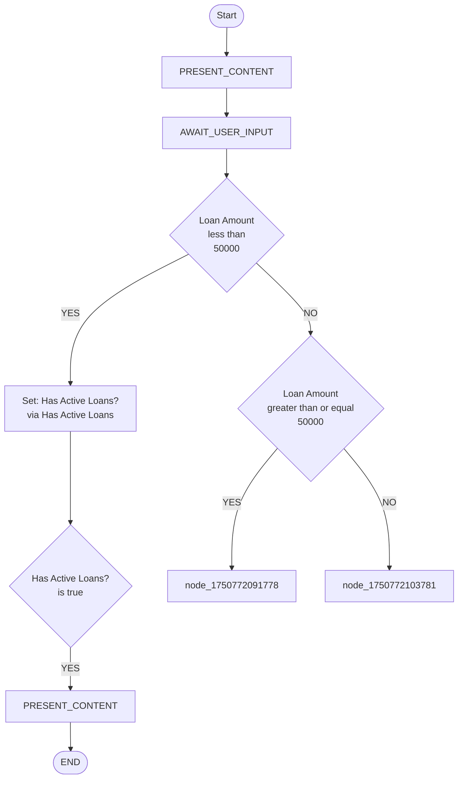

# Workflow Visualization with Mermaid

This document explains the workflow visualization feature that generates Mermaid flowcharts from Journey workflow definitions.

## Overview

The Journey workflow editor includes a powerful visualization feature that automatically converts your YAML workflow definitions into interactive Mermaid flowcharts. This provides a visual representation of your workflow's logic flow, making it easier to understand complex branching and routing patterns.

## Features

### 🎨 Automatic Flowchart Generation

- **One Connected State Machine**: Generates a single, cohesive flowchart that shows the complete workflow flow
- **Smart Node Connections**: Automatically connects workflow nodes based on their logical sequence and explicit GOTO statements
- **Visual Block Representation**: Each workflow block is represented as a distinct visual element with appropriate shapes
- **Intelligent Labels**: Shows meaningful information about conditions, variable assignments, and data sources

### 📊 Visual Elements

The mermaid generator creates different visual elements for different block types:

- **Rectangular Nodes** `[BLOCK_TYPE]`: Standard workflow blocks with enhanced labeling
- **Diamond Nodes** `{CONDITION}`: Conditional logic blocks showing actual conditions being evaluated
- **Rounded Rectangles** `([START/END])`: Start and end workflow markers
- **Labeled Edges**: Connections between blocks with labels like "YES", "NO" for conditional flows

### 🔄 Flow Logic

The visualization handles complex workflow patterns:

1. **Sequential Flow**: Blocks within a node automatically connect in sequence
2. **Conditional Branching**: CONDITION blocks create diamond shapes with YES/NO paths showing actual conditions
3. **Node Transitions**: Automatic connections between workflow nodes when no explicit GOTO is specified
4. **Empty Node Handling**: Nodes without blocks are properly connected in the flow
5. **Terminal States**: END_WORKFLOW blocks are clearly marked as terminal points

## Enhanced Block Visualization

### SET_VARIABLE Blocks

SET_VARIABLE blocks now show detailed information about what's happening:

```yaml
- type: SET_VARIABLE
  target: Has Active Loans?
  action: has_active_loans
  description: "Check user loan status"  # Optional custom description
```

Will display as: `[Check user loan status]` or `[Set: Has Active Loans?<br/>via Has Active Loans]`

### CONDITION Blocks

CONDITION blocks show the actual logic being evaluated:

```yaml
- type: CONDITION
  rules:
    - variable: Loan Amount
      operator: less_than
      value: '50000'
```

Will display as: `{Loan Amount<br/>less than<br/>50000}`

## Usage

### In the Workflow Editor

The mermaid visualization is automatically available in the workflow editor:

1. **Open any workflow** in the Journey editor
2. **Navigate to the Graph tab** (if available) or look for the visualization panel
3. **View the generated flowchart** that updates automatically as you edit the workflow
4. **Expand the details** to see the raw Mermaid definition code

### Example Output

For a loan approval workflow, the generator creates:



## Technical Implementation

### Core Function: `workflowToMermaid`

Located in `src/utils/workflowToMermaid.ts`, this function:

- **Converts workflow objects** to Mermaid syntax
- **Handles node sanitization** for Mermaid compatibility
- **Manages edge generation** for proper flow connections
- **Supports all block types** with enhanced labeling
- **Extracts meaningful information** from block properties

### React Component: `WorkflowGraph`

Located in `src/components/workflow/WorkflowGraph.tsx`, this component:

- **Renders Mermaid diagrams** using the mermaid.js library
- **Handles loading states** and error conditions
- **Provides expandable raw definition** view
- **Auto-updates** when workflow changes

### Integration Points

The visualization integrates with:

- **Workflow Editor**: Real-time updates as workflows are edited
- **YAML Import/Export**: Works with any valid workflow YAML
- **Type System**: Fully typed with TypeScript workflow definitions

## Workflow Block Mapping

| Block Type | Visual Representation | Description |
|------------|----------------------|-------------|
| `PRESENT_CONTENT` | `[PRESENT_CONTENT]` | Rectangular node for content display |
| `AWAIT_USER_INPUT` | `[AWAIT_USER_INPUT]` | Rectangular node for input collection |
| `SET_VARIABLE` | `[Set: Variable Name<br/>via Action Name]` | Shows variable being set and data source. Supports optional `description` field for custom labels |
| `UPDATE_VARIABLE` | `[UPDATE_VARIABLE]` | Rectangular node for variable updates |
| `CONDITION` | `{Variable Name<br/>operator<br/>value}` | Diamond node showing the actual condition being evaluated |
| `GOTO_NODE` | `[GOTO_NODE]` | Rectangular node with targeted connection |
| `END_WORKFLOW` | `([END])` | Rounded rectangle terminal node |

## Custom Descriptions in YAML

You can add custom descriptions to any block for more meaningful visualization by adding a `description` field to your YAML:

```yaml
# SET_VARIABLE with custom description
- type: SET_VARIABLE
  target: Credit Score
  action: get_credit_score
  description: "Fetch Credit Report"
  actionArgs:
    user_id: "12345"
    
# SET_VARIABLE without description (will auto-generate)
- type: SET_VARIABLE
  target: Account Balance
  action: get_account_balance
  actionArgs:
    user_id: "12345"
    
# CONDITION with custom description  
- type: CONDITION
  description: "Check Credit Eligibility"
  rules:
    - variable: Credit Score
      operator: greater_than
      value: '700'
```

When a `description` field is present, it will be used as the block label instead of the auto-generated one.

## Benefits

### For Workflow Design

- **Visual Validation**: Quickly spot logical errors or missing connections
- **Flow Understanding**: See the complete workflow path and logic at a glance
- **Debugging Aid**: Identify unreachable nodes or infinite loops
- **Documentation**: Auto-generated visual documentation for workflows
- **Business Logic Clarity**: Understand conditions and data transformations

### For Collaboration

- **Stakeholder Communication**: Non-technical stakeholders can understand workflow logic
- **Code Reviews**: Visual diffs make workflow changes easier to review
- **Training**: New team members can quickly understand existing workflows
- **Architecture Decisions**: Visual representation aids in workflow design discussions

## Troubleshooting

### Common Issues

1. **Disconnected Nodes**: If you see separate components instead of one connected flow, check that:
   - Nodes have proper sequential order
   - CONDITION blocks have appropriate GOTO_NODE actions
   - Empty nodes are intentionally placed

2. **Rendering Errors**: If the mermaid diagram fails to render:
   - Check the browser console for specific errors
   - Verify the workflow YAML is valid
   - Ensure node IDs don't contain special characters

3. **Complex Layouts**: For very large workflows:
   - Consider breaking into smaller sub-workflows
   - Use clear, descriptive node titles
   - Group related functionality into logical nodes
   - Use custom descriptions for complex operations

### Browser Compatibility

The mermaid visualization works in all modern browsers that support:
- ES6+ JavaScript features
- SVG rendering
- CSS Grid/Flexbox

## Future Enhancements

Potential improvements being considered:

- **Interactive Navigation**: Click nodes to jump to that part of the workflow editor
- **Execution Highlighting**: Show current execution state in the flowchart
- **Custom Styling**: Theme support for different visual styles
- **Export Options**: Save flowcharts as SVG, PNG, or PDF files
- **Zoom and Pan**: Better navigation for large workflow diagrams
- **Enhanced Block Details**: More detailed information for each block type

---

For questions or feature requests related to workflow visualization, please open an issue in the repository.